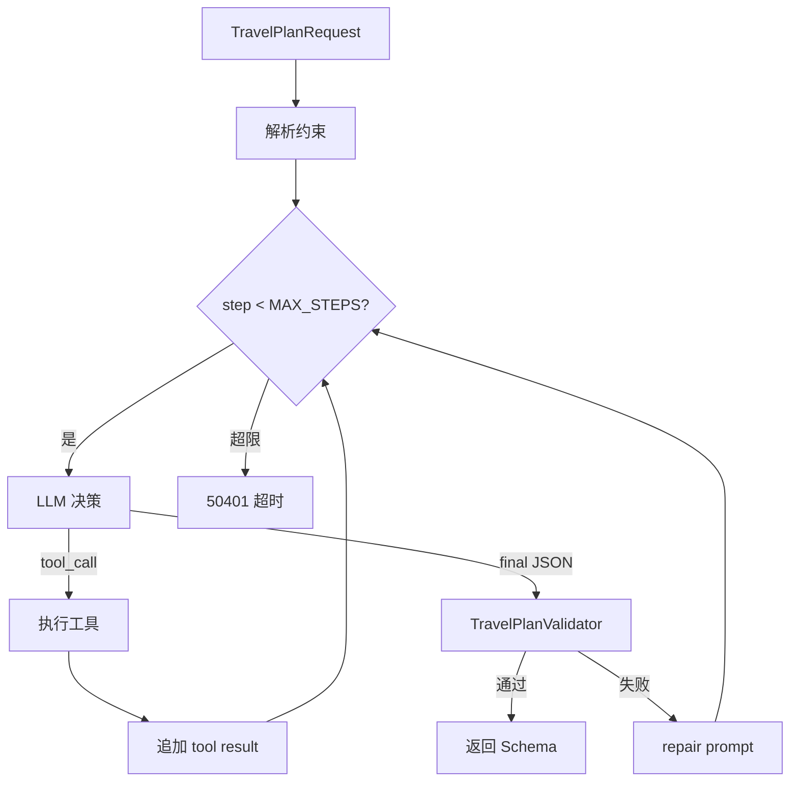

# 情侣行程规划 Agent — 分阶段实施计划

本文档为 **LoveSpace 情侣出游行程规划 Agent** 的可落地参考计划，基于 **2026-06 代码现状** 与产品目标拆解。实施顺序固定为：

**P0 准备与契约 → P1 数据增强规划 → P2 Agent 多步编排 → P3 知识库与产品化**

避免在占位数据（空 POI、无天气）上过早做 Agent 循环或前端产品化。

**关联文档**：

| 文档 | 关系 |
|------|------|
| [decisions.md](./decisions.md) | 架构决策；表结构/API/配置重大变更须同步 §「情侣旅游规划」 |
| [progress.md](./progress.md) | 任务进度与对话摘要 |
| [PROJECT_STRUCTURE.md](./PROJECT_STRUCTURE.md) | API 与前端路由速查 |
| [love-qa-rag.md](./love-qa-rag.md) | Milvus、Embedding、Redis 多轮模式可复用 |
| [RAG_PHASED_OPTIMIZATION.md](./RAG_PHASED_OPTIMIZATION.md) | 分阶段文档结构参考 |
| [goals.md](./goals.md) | 产品范围与共同计划能力 |

**核心代码路径（现状）**：

| 用途 | 路径 |
|------|------|
| 规划主服务 | `lovespace-ai/.../travel/TravelPlannerService.java` |
| HTTP 入口 | `lovespace-ai/.../controller/TravelPlannerController.java` |
| 请求 DTO | `lovespace-ai/.../dto/TravelPlanRequest.java` |
| 响应 Schema | `lovespace-ai/.../travel/TravelPlanJsonSchema.java` |
| 高德占位 | `lovespace-ai/.../travel/AmapPlacesClient.java`（`NoOp`） |
| POI 向量骨架 | `lovespace-ai/.../travel/TravelPoiVectorSearchService.java`（返回空） |
| Bean 注册 | `lovespace-ai/.../config/AiInfraBeansConfiguration.java` |
| AI 配置 | `lovespace-ai/.../config/LovespaceAiProperties.java` |
| 异常映射 | `lovespace-ai/.../controller/AiFeaturesExceptionHandler.java` |
| Milvus 第二集合 | `lovespace-ai/.../milvus/MilvusSchemaService.java`（`travel_poi_embeddings` 骨架） |
| 共同计划实体 | `lovespace-user/.../entity/Plan.java`、`plan_tasks` |
| 共同计划前端 | `lovespace-frontend/src/pages/Plan.tsx` |
| 运行时配置 | `lovespace-user/src/main/resources/application.yml` |

---

## 0. 产品目标与现状

### 0.1 背景与目标

| 维度 | 说明 |
|------|------|
| **背景** | 情侣出游需大量查攻略、排景点与餐厅、兼顾天气与节奏，费时费力 |
| **目标** | 根据日期、出发地、目的地、天气、景点、美食、预算与偏好，自动推荐并输出可执行行程 |
| **差异化** | 情侣向：浪漫节奏、共情文案、预算透明、雨天/高温自适应 |
| **与共同计划关系** | 生成结果可保存为 `couple_plans`（`plan_type=travel`）+ `plan_tasks` |

### 0.2 现状摘要

| 能力 | 状态 | 说明 |
|------|------|------|
| `POST /api/v1/ai/travel/plan` | ✅ 已存在 | 单次 LLM + JSON 输出 |
| 输入字段 | ⚠️ 不完整 | 缺出发地、具体日期、节奏、避坑标签 |
| 高德 POI | ❌ 占位 | `AmapPlacesClient.NoOp` 恒返回空 |
| 天气 | ❌ 未实现 | 无客户端 |
| POI 向量检索 | ❌ 骨架 | `poi-vector-search-enabled` 默认 false，检索返回空 |
| Agent 多步循环 | ❌ 未实现 | 无工具调用编排 |
| 前端规划页 | ❌ 未实现 | 无 `/travel-planner` 路由 |
| 保存到共同计划 | ❌ 未实现 | AI JSON 与 `couple_plans` 未打通 |
| JSON 修复 | ⚠️ TODO | 解析失败仅 warn，无 repair prompt |

### 0.3 阶段依赖关系

```
P0 准备与契约（DTO、配置、API Key、错误码）
        ↓
P1 数据增强规划（天气 + 高德 POI 注入，仍单次 LLM）
        ↓
P2 Agent 多步编排（工具层 + 校验 + 修复）
        ↓
P3 知识库 + 产品化（POI 向量、前端页、保存计划、多轮微调）
```

**原则**：

- P2 的工具应复用 P1 已实现的 `WeatherClient`、`AmapPlacesClient`，勿重复封装。
- P3 的 POI 向量库可在 P1/P2 验收后并行；首期可仅依赖高德文本 POI。
- 前端页（P3）可在 P2 后端稳定后启动，不必等 POI 向量入库完成。

### 0.4 里程碑

| 里程碑 | 建议周期 | 交付物 | 验收方式 |
|--------|----------|--------|----------|
| **M0** | +5 天 | DTO 定稿、配置骨架、Key 就绪 | 设计评审 |
| **M1** | +2 周 | P1 接口可用 | 3 城样例人工评分 ≥ 7/10 |
| **M2** | +5 周 | P2 Agent 接口 | 同输入 P1 vs P2 对比优于 P1 |
| **M3** | +8 周 | P3 全链路 | 填表 → 生成 → 保存 → `/plan` 可见 |

**工期参考**：单人兼职约 6–8 周；全职可压缩至 3–4 周。

---

## P0：准备与契约冻结（3–5 天）

**目标**：冻结前后端数据契约、配置项、错误码与外部依赖，避免 P1 返工。

**阶段完成定义（DoD）**：

- [ ] `TravelPlanRequest` / `TravelPlanJsonSchema` 扩展字段评审通过
- [ ] `application.yml` 新增 travel 子配置占位（无 Key 可启动）
- [ ] 错误码表写入本文档 §附录 A
- [ ] 首期支持城市列表确定（建议 3–5 城）
- [ ] 高德 / 天气 API Key 申请路径明确（可有 Key 或暂用 Mock）

### P0 任务表

| ID | 任务 | 涉及文件 | 具体动作 | 验收标准 |
|----|------|----------|----------|----------|
| P0-01 | 申请高德 Web 服务 Key | — | Place Search、地理编码；可选 Direction | Key 可写入 `application-local.yml` |
| P0-02 | 申请和风天气 Key | — | 7 日预报 API | 或决策仅用高德天气 |
| P0-03 | 确认 LLM 配额 | `application.yml` | `lovespace.ai.provider` 通义/OpenAI | 长耗时接口 timeout ≥120s |
| P0-04 | 确认 Milvus / Redis | `blockers.md` | 本地或 Docker 可启动 | `lovespace-user` 正常启动 |
| P0-05 | 首期城市列表 | 本文档 §0.5 | 产品确认 | 写入配置或常量 |
| P0-06 | 扩展请求 DTO | `TravelPlanRequest.java` | 见 §1.1 字段表 | 校验注解完整 |
| P0-07 | 扩展响应 Schema | `TravelPlanJsonSchema.java` | 见 §1.2 字段表 | 样例 JSON 可反序列化 |
| P0-08 | 错误码约定 | `AiFeaturesExceptionHandler.java` | 见 §附录 A | 与 `ApiResponse` 一致 |
| P0-09 | 配置项设计 | `LovespaceAiProperties.java`、`application.yml` | 见 §附录 B | 无 Key 时 NoOp，启动无 NPE |

### 0.5 首期支持城市（待产品确认）

| 城市 | 优先级 | POI 入库目标（P3） |
|------|--------|-------------------|
| 杭州 | P0 | ≥200 条 |
| 成都 | P0 | ≥200 条 |
| 厦门 | P1 | ≥200 条 |
| 西安 | P1 | ≥150 条 |
| 大理 | P2 | ≥150 条 |

---

## P1：数据增强版规划（1–2 周）

**目标**：不引入 Agent 循环，先将**真实天气与 POI 数据**注入 `TravelPlannerService`，显著提升规划依据。

**阶段完成定义（DoD）**：

- [ ] `WeatherClient` + 实现类可返回目的地日期范围内日预报
- [ ] `AmapPlacesClientImpl` 替换 `NoOp`，返回景点/餐厅列表
- [ ] `TravelContextBuilder` 组装天气 + POI + 偏好，注入 prompt
- [ ] `TravelPlanRequest` 支持出发地、起止日期、pace、avoidTags
- [ ] JSON repair 管道：解析失败时一次修复 prompt
- [ ] 3 城验收用例（§1.4）人工评分 ≥ 7/10
- [ ] 外部 API 失败时优雅降级（空列表 + warn，仍返回 JSON）

### 1.1 请求契约（目标）

| 字段 | 类型 | 必填 | 校验 | 说明 |
|------|------|------|------|------|
| `departureCity` | string | 是 | `@NotBlank` | 出发城市 |
| `destination` | string | 是 | `@NotBlank` | 目的地城市 |
| `startDate` | date | 是 | `>= today` | ISO `yyyy-MM-dd` |
| `endDate` | date | 是 | `>= startDate` | 与 `days` 一致 |
| `days` | int | 是 | 1–30 | `endDate - startDate + 1 == days` |
| `budgetMin` | int | 否 | ≥0 | 总预算下限（元） |
| `budgetMax` | int | 否 | ≥ budgetMin | 总预算上限 |
| `preferences` | string[] | 否 | — | 浪漫、美食、轻松、拍照… |
| `pace` | enum | 否 | relaxed/moderate/packed | 行程节奏 |
| `avoidTags` | string[] | 否 | — | 爬山、早起、排队… |
| `transportMode` | string | 否 | — | 高铁、自驾等 |

### 1.2 响应契约（目标）

在现有 `TravelPlanJsonSchema` 上扩展：

```json
{
  "destination": "杭州",
  "days": 3,
  "summary": "情侣向导语与预算预估",
  "estimatedBudgetMin": 2800,
  "estimatedBudgetMax": 3500,
  "dailyPlans": [
    {
      "dayIndex": 1,
      "date": "2026-10-01",
      "theme": "西湖浪漫日",
      "weather": {
        "text": "晴",
        "tempMin": 18,
        "tempMax": 28,
        "precipProbability": 10,
        "tip": "防晒、傍晚出行更舒适"
      },
      "items": [
        {
          "timeSlot": "09:00-11:30",
          "order": 1,
          "title": "西湖苏堤漫步",
          "type": "attraction",
          "description": "...",
          "locationHint": "西湖景区",
          "foodRecommendations": [],
          "poiId": "可选，高德 POI ID",
          "estimatedCost": 0,
          "coupleTip": "牵手散步，傍晚光线更柔和"
        }
      ]
    }
  ]
}
```

`type` 枚举保持：`attraction` | `meal` | `transport`。

### 1.3 P1 任务表

#### 1.3.1 外部 API 客户端

| ID | 任务 | 新建/修改文件 | 具体实现 | 验收标准 |
|----|------|---------------|----------|----------|
| P1-01 | 天气客户端接口 | `travel/weather/WeatherClient.java` | `getForecast(city, start, end)` | 接口 + JavaDoc |
| P1-02 | 天气 DTO | `travel/weather/DailyWeather.java` | date、text、temp、precip、tip | 可序列化进 prompt |
| P1-03 | 和风实现 | `travel/weather/QWeatherClient.java` | RestClient + 配置 api-key | 杭州 3 日有数据 |
| P1-04 | 扩展高德接口 | `travel/AmapPlacesClient.java` | `searchAttractions`、`searchRestaurants`、`searchHints` | 接口文档完整 |
| P1-05 | 高德实现 | `travel/AmapPlacesClientImpl.java` | 地理编码 + Place Text Search | 返回 name、address、type |
| P1-06 | POI 结果 DTO | `travel/AmapPoiBrief.java` | 统一 POI 摘要结构 | Builder 或 record |
| P1-07 | 配置与 Bean | `LovespaceAiProperties.Travel`、`AiInfraBeansConfiguration` | 有 Key 用 Impl，无 Key 用 NoOp | 条件 Bean |
| P1-08 | 超时与降级 | 各 Client | connect 5s、read 10s；失败空列表 | 不拖垮主流程 |

**高德 P1 最小 API 集**：

| API | 用途 |
|-----|------|
| 地理编码 | 城市名 → adcode |
| Place Text Search | 景点（偏好关键词） |
| Place Text Search | 餐厅（菜系/浪漫） |

#### 1.3.2 编排层（仍单次 LLM）

| ID | 任务 | 涉及文件 | 具体动作 | 验收标准 |
|----|------|----------|----------|----------|
| P1-09 | 上下文组装器 | `travel/TravelContextBuilder.java` | 并行拉取天气 + 景点 + 美食 | 输出 `TravelPlanningContext` |
| P1-10 | 改造 Service | `TravelPlannerService.java` | build context → 拼 user prompt | 日志含 context 摘要 |
| P1-11 | 升级 System Prompt | `TravelPlannerService` | 雨天室内、高温避午、情侣节奏、引用真 POI 名 | 3 组样例评审 |
| P1-12 | JSON 修复 | `TravelPlannerService` | 解析失败 → repair prompt 一次 | 非法 JSON 率 < 5% |
| P1-13 | 日期校验 | Request + Controller | days 与日期范围互校 | 400 明确 message |
| P1-14 | 并行优化 | `TravelContextBuilder` | `CompletableFuture` 天气+POI | 端到端耗时下降 |
| P1-15 | 集成测试 | `lovespace-ai/src/test/...` | Mock HTTP，断言 prompt 含 POI | CI 可过 |

**System Prompt 情侣规则（须写入 P1-11）**：

| 场景 | Agent/LLM 行为 |
|------|----------------|
| 浪漫 | 日落观景点、夜景餐厅、少赶路 |
| 美食 | 每餐 1–2 家本地特色，标注人均 |
| 轻松（relaxed） | 每天 ≤4 个 item，留自由时间 |
| 预算 | summary 含总花费区间；超预算降级推荐 |
| 雨天 | 博物馆、商场、咖啡馆等室内 |
| 高温 | 户外放早晚，中午室内/rest |

### 1.4 P1 验收用例

| 用例 ID | 输入 | 期望 |
|---------|------|------|
| UC-01 | 上海→杭州，3 日，浪漫+美食 | 每日有 theme；含真实餐厅/景点名；有 coupleTip |
| UC-02 | budgetMax=1500 | summary 含预算；单项不过奢 |
| UC-03 | pace=relaxed | 每日 ≤4 item；有午休或自由时段 |
| UC-04 | 10 月含雨天 | 雨天日有室内项；weather 字段有值 |
| UC-05 | 关闭 amap Key | 仍返回合法 JSON；summary 注明地图数据不可用 |

---

## P2：Agent 多步编排（2–3 周）

**目标**：从单次 prompt 升级为 **工具调用 → 推理 → 校验 → 修复** 的 Agent 循环。

**阶段完成定义（DoD）**：

- [ ] `TravelAgentTool` 接口与 ≥4 个工具实现
- [ ] `TravelPlannerAgentService` 循环 `MAX_STEPS=8` 可终止
- [ ] `TravelPlanValidator` 校验 days/距离/预算/时段
- [ ] 校验失败触发 repair 步，二次成功率 > 90%
- [ ] `POST /api/v1/ai/travel/plan/agent`（或 `?mode=agent`）与 P1 接口并存
- [ ] 结构化日志：每步 toolName、耗时、结果条数
- [ ] 整次规划 120s 超时；单工具 15s

### 2.1 Agent 执行流程（约定顺序）

```
Step 1  get_weather_forecast     — 目的地日期范围天气
Step 2  search_attractions       — 按 preferences 搜景点
Step 3  search_restaurants       — 按美食/浪漫搜餐厅
Step 4  search_travel_guides     — 攻略 RAG（P3 有数据后更有价值）
Step 5  compose_itinerary        — LLM 生成 TravelPlanJsonSchema JSON
Step 6  validate_plan            — 不通过 → repair（回到 Step 5）
```



### 2.2 P2 任务表

#### 2.2.1 工具层

| ID | 任务 | 新建文件 | 说明 |
|----|------|----------|------|
| P2-01 | 工具接口 | `travel/agent/TravelAgentTool.java` | name、description、execute |
| P2-02 | 工具注册表 | `travel/agent/TravelToolRegistry.java` | name → tool |
| P2-03 | 天气工具 | `travel/agent/tools/WeatherForecastTool.java` | 包装 WeatherClient |
| P2-04 | 景点工具 | `travel/agent/tools/SearchAttractionsTool.java` | city + keywords + limit |
| P2-05 | 美食工具 | `travel/agent/tools/SearchRestaurantsTool.java` | city + cuisine + priceLevel |
| P2-06 | 距离工具（可选） | `travel/agent/tools/EstimateDistanceTool.java` | 同日景点路程分钟数 |
| P2-07 | 攻略 RAG 工具 | `travel/agent/tools/TravelGuideRagTool.java` | 独立 metadata 过滤 |
| P2-08 | Agent 状态 | `travel/agent/TravelAgentState.java` | request、messages、toolResults |

#### 2.2.2 编排与 API

| ID | 任务 | 新建/修改文件 | 说明 |
|----|------|---------------|------|
| P2-09 | Agent 服务 | `travel/agent/TravelPlannerAgentService.java` | 主循环 |
| P2-10 | LLM 工具调用 | `LLMProvider` 扩展或 Spring AI `@Tool` | 输出 tool_calls JSON |
| P2-11 | 行程校验器 | `travel/TravelPlanValidator.java` | days、timeSlot、预算、距离 |
| P2-12 | 修复步 | Agent 服务 | 校验错误喂回 LLM |
| P2-13 | API 入口 | `TravelPlannerController.java` | 新端点或 query mode |
| P2-14 | 指标（可选） | `travel/metrics/TravelMetricsCollector.java` | 仿 RagMetricsCollector |
| P2-15 | 异常映射 | `AiFeaturesExceptionHandler.java` | 50401 超时等 |
| P2-16 | Redis 缓存 | 天气 6h、POI 24h | 降低外部 API 压力 |

### 2.3 P2 验收

| 对比项 | P1 | P2 应优于 |
|--------|-----|-----------|
| POI 名称来源 | prompt 注入 | 工具分步检索，名称更准 |
| 雨天调整 | 依赖 prompt 遵守 | 先查天气再排程，逻辑更稳 |
| 复杂偏好 | 一次塞入 | 分工具查询后组合 |
| 非法 JSON | repair 一次 | validator + repair 闭环 |

---

## P3：知识库与产品化（2–3 周）

**目标**：POI 向量库、前端规划页、保存共同计划、多轮微调，形成完整用户链路。

**阶段完成定义（DoD）**：

- [ ] `travel_poi_embeddings` 启用，首期 3 城各 ≥200 条 POI
- [ ] `TravelPoiVectorSearchService` 真实检索
- [ ] 前端 `/travel-planner` 填表 → 展示 → 保存
- [ ] 保存后 `/plan` 可见旅行计划与子任务
- [ ] （可选）`POST /api/v1/ai/travel/refine` 多轮微调
- [ ] （可选）`POST /api/v1/ai/travel/plan/stream` SSE

### 3.1 POI 向量知识库

| ID | 任务 | 涉及文件 | 具体动作 | 验收标准 |
|----|------|----------|----------|----------|
| P3-01 | 启用集合 | `application.yml` | `ensure-travel-poi-schema: true` | 启动创建集合 |
| P3-02 | 向量检索 | `TravelPoiVectorSearchService.java` | embed + Milvus search | 语义查询有命中 |
| P3-03 | POI 文档模型 | `travel/poi/TravelPoiDocument.java` | metadata: city、tags、price | 可按 city 过滤 |
| P3-04 | 入库管道 | `travel/poi/TravelPoiIngestService.java` | CSV/JSON → vectorStore.add | 批量入库脚本 |
| P3-05 | 管理接口 | `TravelPoiAdminController.java` | `POST .../travel/poi/ingest` | 内部/管理员 |
| P3-06 | 语义工具 | `SearchPoiSemanticTool.java` | Agent 工具 | 与高德去重合并 |
| P3-07 | 配置开关 | `poi-vector-search-enabled: true` | 生产按需开启 | 文档说明依赖 |

**POI 数据来源优先级**：

| 来源 | 方式 | 阶段 |
|------|------|------|
| 高德批量搜索 | 脚本按城市+类目拉取 | P3 首批 |
| 手工精选 | 情侣向网红店 | P3 |
| 攻略提取 | 游记 → geocode | P3+ |

### 3.2 攻略 RAG（推荐）

| ID | 任务 | 说明 |
|----|------|------|
| P3-08 | metadata 隔离 | `docType=travel_guide`，不与恋爱 RAG 混检 |
| P3-09 | 入库 10–20 篇/城 | 城市概览、必去、避坑 |
| P3-10 | Prompt 引用 | summary 可标注【攻略】来源 |

### 3.3 前端

| ID | 任务 | 新建/修改文件 | 说明 |
|----|------|---------------|------|
| P3-11 | API 服务 | `src/services/travelPlanner.ts` | timeout 120000 |
| P3-12 | 规划页 | `src/pages/TravelPlanner.tsx` | 表单 + 生成 |
| P3-13 | 结果组件 | `src/components/TravelPlanResult.tsx` | 按日折叠、天气条 |
| P3-14 | 路由 | `App.tsx`、`AppLayout` | `/travel-planner` |
| P3-15 | 入口 | Plan 页或顶栏 | 需登录 |
| P3-16 | 加载态 | TravelPlanner.tsx | 分阶段文案 |
| P3-17 | 错误提示 | 映射 50201/50301/50401 | Ant Design message |

**表单字段（与 P0 契约一致）**：

- 出发地、目的地（Input）
- 日期（RangePicker → startDate/endDate，自动算 days）
- 预算（InputNumber 区间）
- 偏好（Select tags：浪漫、美食、轻松、拍照…）
- 节奏（Radio：轻松/适中/紧凑）
- 避坑（Select tags：爬山、早起、排队…）
- 出行方式（Select，可选）

### 3.4 与共同计划打通

| ID | 任务 | 涉及文件 | 映射规则 |
|----|------|----------|----------|
| P3-18 | 保存服务 | `TravelPlanSaveService.java` 或扩 `PlanService` | AI JSON → DB |
| P3-19 | Plan 字段 | `couple_plans` | title=「{destination} {days}日游」；plan_type=travel；start/end_date；budget_total |
| P3-20 | 任务映射 | `plan_tasks` | 每个 PlanItem → task（title、due_date=当天 date） |
| P3-21 | 描述存储 | `description` | 存 summary + 完整 JSON（或 Markdown） |
| P3-22 | 前端保存 | `TravelPlanResult.tsx` | 按钮 → createPlan + 批量 tasks → 跳转 `/plan` |

**PlanItem → plan_task 映射示例**：

| PlanItem 字段 | plan_task 字段 |
|---------------|----------------|
| `title` | `title` |
| `dailyPlans[].date` | `due_date` |
| `description` + `coupleTip` | 可拼入 title 或后续扩展 task 描述列 |

### 3.5 多轮微调（可选增强）

| ID | 任务 | 说明 |
|----|------|------|
| P3-23 | 会话存储 | 复用 Redis（参考 `LoveQAConversationStore`） |
| P3-24 | 微调 API | `POST /api/v1/ai/travel/refine` + conversationId |
| P3-25 | 流式 | `POST /api/v1/ai/travel/plan/stream` SSE |

---

## 横切任务（贯穿各阶段）

| ID | 类别 | 任务 | 建议阶段 |
|----|------|------|----------|
| X-01 | 安全 | API Key 仅后端；日志禁止 token/Key | P1 起 |
| X-02 | 测试 | 每阶段 ≥3 集成测试 | 每阶段末 |
| X-03 | 文档 | 同步 `decisions.md`、`progress.md` | 每阶段末 |
| X-04 | 性能 | 天气+高德并行（P1-14） | P1 |
| X-05 | 缓存 | Redis：天气 6h、POI 24h | P2 |
| X-06 | 限流 | 每用户每日规划次数（如 10） | P3 上线前 |
| X-07 | 观测 | 记录 runId、每步 tool、总耗时 | P2 |

---

## 风险与应对

| 风险 | 影响 | 应对 |
|------|------|------|
| 高德/天气配额不足 | POI 少 | Mock + 缓存；首期限城市 |
| LLM JSON 不稳定 | 50201 增多 | repair + 降 temperature |
| 规划 >120s | 前端超时 | 并行拉数；P3 SSE |
| POI 冷启动 | 语义检索无效 | P1–P2 依赖高德；P3 补向量 |
| `couple_plans` 模型偏简 | 存不下丰富行程 | description 存 JSON；后续可加 `itinerary_json` 列 |
| 工具调用模型差异 | 通义/OpenAI 行为不一 | `LlmRouter` 分实现或统一 JSON schema 约束 |

---

## 建议执行顺序（严格串行主干）

```
P0-06 → P0-07 → P0-09
  → P1-01~08（天气+高德）
  → P1-09~15（Service 升级）
  → P1 验收（UC-01~05）
  → P2-01~16（Agent）
  → P2 验收
  → P3-11~17（前端，可与 P3-01 并行）
  → P3-18~22（保存计划）
  → P3-01~10（POI 库，可后置）
  → P3-23~25（微调，可后置）
```

---

## 附录 A：错误码（规划）

| code | HTTP | 含义 | 阶段 |
|------|------|------|------|
| 50201 | 502 | 模型返回非合法 JSON | 已有 |
| 50301 | 503 | AI 服务不可用 | 已有 |
| 50302 | 503 | 天气服务不可用（已降级） | P1 |
| 50303 | 503 | 地图 POI 服务不可用（已降级） | P1 |
| 40401 | 404 | 目的地无 POI 命中（可继续生成） | P1 |
| 50401 | 504 | Agent 规划超时 | P2 |
| 40001 | 400 | 日期与 days 不一致 | P1 |
| 40002 | 400 | startDate 早于今天 | P1 |

---

## 附录 B：配置项（规划）

```yaml
lovespace:
  ai:
    travel:
      poi-vector-search-enabled: false   # P3 改为 true
      amap:
        api-key: ${AMAP_API_KEY:}
        enabled: true
        connect-timeout-ms: 5000
        read-timeout-ms: 10000
      weather:
        provider: qweather              # qweather | amap
        api-key: ${QWEATHER_API_KEY:}
        enabled: true
      agent:
        max-steps: 8
        total-timeout-seconds: 120
        tool-timeout-seconds: 15
      cache:
        weather-ttl-seconds: 21600        # 6h
        poi-search-ttl-seconds: 86400     # 24h
      rate-limit:
        plans-per-user-per-day: 10        # P3 上线前
  milvus:
    ensure-travel-poi-schema: false      # P3 改为 true
    travel-poi-collection-name: travel_poi_embeddings
```

---

## 附录 C：API 端点（规划）

| 方法 | 路径 | 阶段 | 说明 |
|------|------|------|------|
| POST | `/api/v1/ai/travel/plan` | 已有/P1 增强 | 单次 LLM（P1 数据增强） |
| POST | `/api/v1/ai/travel/plan/agent` | P2 | Agent 多步 |
| POST | `/api/v1/ai/travel/plan/stream` | P3 可选 | SSE 流式 |
| POST | `/api/v1/ai/travel/refine` | P3 可选 | 多轮微调 |
| POST | `/api/v1/ai/travel/poi/ingest` | P3 | POI 入库（内部） |
| POST | `/api/v1/ai/travel/save-to-plan` | P3 | AI 结果保存为 couple_plan |

均需登录（JWT）；长耗时前端 `http.ts` timeout ≥120s。

---

## 附录 D：会话接续 checklist

新会话接手行程规划 Agent 时，按序核对：

- [ ] 读本文档 §0.2 确认当前阶段（P0/P1/P2/P3 哪项 DoD 已勾选）
- [ ] 读 `progress.md` 对话摘要是否有 travel 相关进度
- [ ] 确认 `AmapPlacesClient` 仍为 NoOp 或已替换 Impl
- [ ] 确认 `application-local.yml` 是否有 amap/weather Key
- [ ] 跑通 `POST /api/v1/ai/travel/plan` 样例（Postman 或 curl）
- [ ] 若做 P2：确认 `LLMProvider` 是否已支持 tool calling
- [ ] 若做 P3：确认 `ensure-travel-poi-schema` 与 Milvus 状态
- [ ] 若做前端：确认 `App.tsx` 是否已有 `/travel-planner`

**推荐起步（无 Key）**：P0-06/07 → P1 客户端接口 + Mock 实现 → Service 注入 Mock 数据验收 prompt 结构。

**推荐起步（有 Key）**：P1-01~08 真实天气高德 → P1-09~12 Service 升级 → UC-01 杭州 3 日验收。

---

## 变更记录

| 日期 | 说明 |
|------|------|
| 2026-06-16 | 初版：P0–P3 任务表、契约、验收、附录 |
